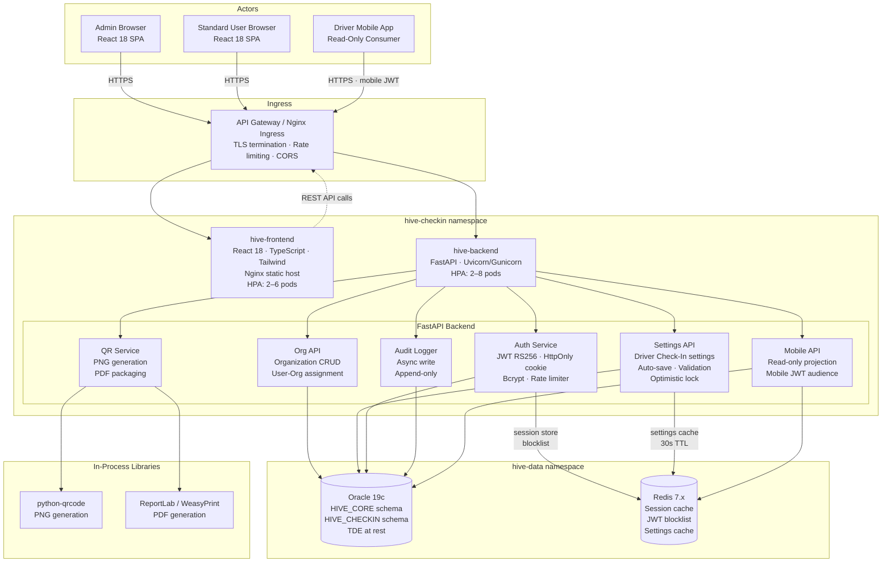
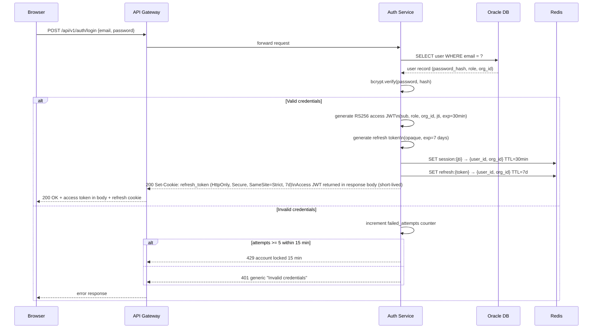
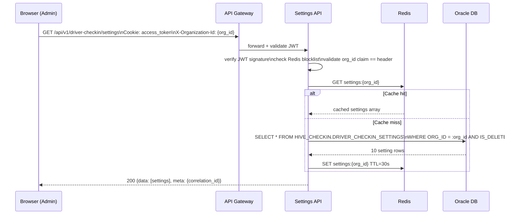
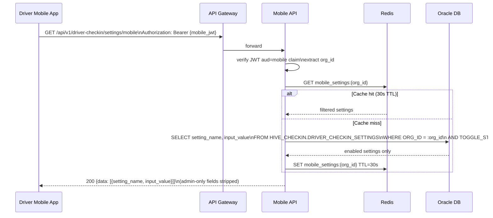
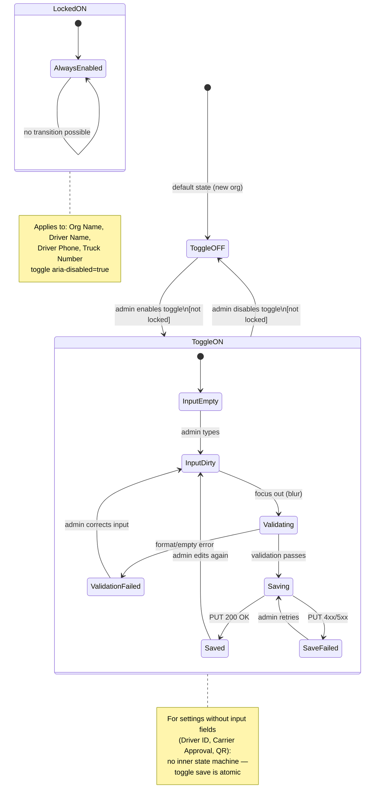
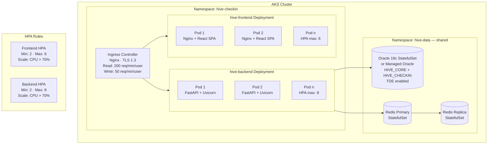
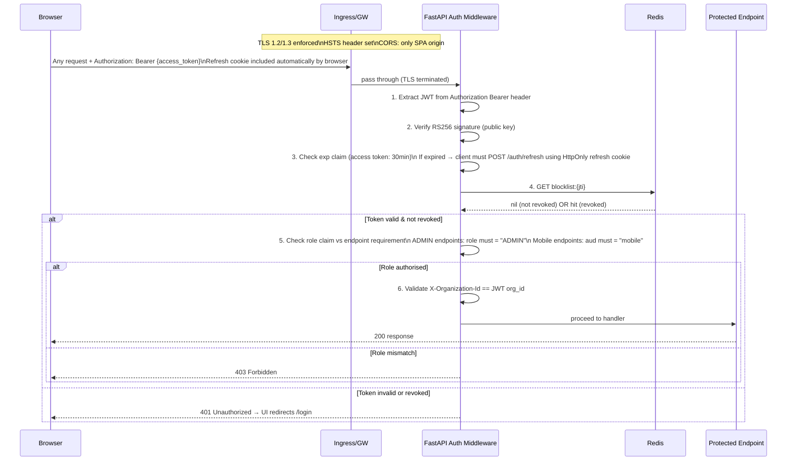

# High-Level Design (HLD)
## Driver Check In Admin Module — The Hive (Schreiber Foods)
**Document Version:** 1.0.0
**Baseline Reference:** kb-L3-driver-checkin-baseline v0.1.0
**Epic Coverage:** EP-01 through EP-05 (Sprints 1–4)
**Stack:** Python 3.12 + FastAPI (backend) · React 18 + TypeScript + Vite + TanStack Query + Zustand + React Hook Form + Zod (frontend)

---

## 1. System Component Diagram



---

## 2. Data Flow Diagrams

### 2.1 Authentication Flow [EP-01 · F-01.1]



### 2.2 Settings Load Flow [EP-02 · F-02.1, F-02.3]



### 2.3 Auto-Save Flow [EP-02 · F-02.2]

```mermaid
sequenceDiagram
    participant B as Browser (Admin)
    participant GW as API Gateway
    participant SETTINGS as Settings API
    participant ORA as Oracle DB
    participant AUDIT as Audit Logger

    B->>GW: PUT /api/v1/driver-checkin/settings/{id}\n{toggle_state|input_value, version_num}
    GW->>SETTINGS: forward + validate JWT

    SETTINGS->>SETTINGS: client-side validation\nalready ran; backend re-validates\n(defense in depth)

    SETTINGS->>ORA: SELECT VERSION_NUM FROM DRIVER_CHECKIN_SETTINGS WHERE ID = :id\n[READ COMMITTED isolation]
    ORA-->>SETTINGS: current version

    alt version_num matches
        SETTINGS->>ORA: UPDATE DRIVER_CHECKIN_SETTINGS SET\n  toggle_state/input_value = :new_val\n  version_num = version_num + 1\n  updated_at = NOW()\n  updated_by = :user_id\nWHERE id = :id AND version_num = :expected\n[SERIALIZABLE isolation]
        ORA-->>SETTINGS: 1 row updated
        SETTINGS->>REDIS: DEL settings:{org_id}  ← invalidate cache
        SETTINGS->>AUDIT: async write audit entry\n(non-blocking)
        SETTINGS-->>B: 200 {data: {id, version_num: new_version}}
    else version_num stale
        SETTINGS-->>B: 409 Conflict\n"Settings modified by another user — reload to continue"
    end

    Note over AUDIT,ORA: Audit write failure → alert ops\ndoes NOT roll back settings save (US-034 AC-034-4)
```

### 2.4 QR Code Generation & PDF Download Flow [EP-04 · F-04.1–F-04.3]

```mermaid
sequenceDiagram
    participant B as Browser (Admin)
    participant GW as API Gateway
    participant QRSVC as QR Service
    participant ORA as Oracle DB
    participant QRLIB as python-qrcode
    participant PDFLIB as ReportLab/WeasyPrint

    B->>GW: POST /api/v1/driver-checkin/qr-code\nCookie: access_token
    GW->>QRSVC: forward + validate JWT (ADMIN role required)
    QRSVC->>ORA: SELECT name FROM HIVE_CORE.ORGANIZATIONS\nWHERE ID = :org_id
    ORA-->>QRSVC: org_name
    QRSVC->>QRLIB: generate_qr(url=mobile_checkin_url_for_org)
    QRLIB-->>QRSVC: PNG bytes (BytesIO, in-process)
    QRSVC-->>B: 200 Content-Type: image/png\n[QR PNG bytes]

    Note over B: Modal opens, QR image displayed

    B->>GW: GET /api/v1/driver-checkin/qr-code/pdf\nCookie: access_token
    GW->>QRSVC: forward + validate JWT
    QRSVC->>QRLIB: regenerate QR PNG
    QRSVC->>PDFLIB: build_pdf(qr_png, org_name)
    PDFLIB-->>QRSVC: PDF bytes
    QRSVC-->>B: 200 Content-Type: application/pdf\nContent-Disposition: attachment;\n filename="QR-{ORG_NAME}-checkin.pdf"
```

### 2.5 Mobile Settings Consumption Flow [EP-05 · F-05.1]



---

## 3. Application Settings State Machine [EP-02 · BL8]



### Setting State Summary

| Setting | Default Toggle | Locked | Has Input | Input Required When ON |
|---------|---------------|--------|-----------|----------------------|
| Organization Name | ON | Yes | Yes (read-only, pre-populated) | N/A |
| QR Code Check In Access | ON | No | No (action button) | N/A |
| Driver Name | ON | Yes | No | N/A |
| Driver ID | ON | No | No | N/A |
| Driver Phone Number | ON | Yes | No | N/A |
| Truck Number | ON | Yes | No | N/A |
| Carrier Approval Step | ON | No | No | N/A |
| Temperature Acknowledgement | OFF | No | Yes (alphanumeric) | Yes |
| Early Check In Step | OFF | No | Yes (numeric hours + text) | Yes (both fields) |
| Confirmation Step | ON | No | Yes (free text) | Yes |

---

## 4. Deployment View [EP-01 · BL6]



### Container Specs

| Service | Image Base | Port | Resources (request/limit) | Probes |
|---------|-----------|------|--------------------------|--------|
| hive-frontend | nginx:alpine (multi-stage: node:20-alpine build → nginx serve) | 80 | 100m/500m CPU · 128Mi/256Mi | `/` (200) |
| hive-backend | python:3.12-slim | 8000 | 250m/1000m CPU · 256Mi/512Mi | `/health` · `/health/ready` |
| hive-worker | python:3.12-slim (Celery worker) | — | 250m/1000m CPU · 256Mi/512Mi | Celery inspect ping |
| hive-scheduler | python:3.12-slim (Celery Beat) | — | 100m/500m CPU · 128Mi/256Mi | — |

> `hive-worker` and `hive-scheduler` are required by EA6 for async task processing (audit log writes, cache warm-up tasks). All images: non-root user, <200MB, health check defined.

### Rolling Deployment Strategy
- `strategy.type: RollingUpdate`
- `maxSurge: 1` · `maxUnavailable: 0`
- Alembic migration runs as a pre-deploy Job (additive-only; existing pods remain functional)
- Post-deploy smoke test: `GET /health/ready` must return 200 before traffic shifts

---

## 5. Security View [EP-01 · F-01.1, F-01.2]



### Encryption Boundaries

| Boundary | Mechanism | Standard |
|----------|-----------|----------|
| Browser → Ingress | TLS 1.3 | All traffic |
| Ingress → Backend pods | TLS (cluster-internal) | mTLS optional |
| Oracle data at rest | TDE (Transparent Data Encryption) | AES-256 |
| EMAIL column (USERS) | Oracle TDE column-level | AES-256 |
| JWT signing key | RS256 private key in K8s Secret (Vault-sourced) | RSA-2048 |
| Redis channel | TLS + AUTH password | — |

---

## 6. Observability

| Signal | Tool | Key Metrics |
|--------|------|------------|
| Structured logs | `structlog 24.x` JSON → stdout → log aggregator | Every entry: timestamp, level, correlation_id, org_id, user_id, message (EA9) |
| Distributed tracing | OpenTelemetry | Traces across API → Service → DB → Redis; exported to configured backend (EA9) |
| Health probes | GET `/health` (liveness) · GET `/health/ready` (readiness — DB + Redis connected) | AKS pod lifecycle |
| Metrics | Prometheus (`prometheus-fastapi-instrumentator`) | Request rate · P95 latency · error rate per endpoint |
| Dashboards | Grafana | System health · API performance · error rates |
| Auto-save latency | Custom Prometheus histogram: PUT received → 200 response | Target < 2s (NFR-01) |
| Validation latency | Custom metric: blur event → error display | Target < 200ms (NFR-02) |
| Alerting | Grafana Alerts | P1: API down. P2: latency > 2× target. P3: error rate > 1% |
| Circuit breaker events | Log `CIRCUIT_OPEN` / `CIRCUIT_CLOSE` events | Alert on any OPEN event |

---

## 7. NFR Compliance Summary

| NFR | Target | Mechanism | Epic |
|-----|--------|-----------|------|
| Auto-save latency | < 2 seconds | Async FastAPI handler · indexed Oracle lookup · Redis eliminates repeated auth lookups | EP-02 |
| Validation feedback | < 200ms | Client-side validation on blur; no round-trip for format errors | EP-02 |
| Page load | < 1 second | React code-split · Tailwind purge · Nginx static caching · CDN headers | EP-02 |
| Availability | 99.9% | AKS HPA (min 2 pods) · Oracle RMAN backup · Redis replica | All |
| WCAG 2.1 AA | Full compliance | Radix UI primitives · 44px touch targets · axe-core + Playwright audit Sprint 4 | EP-05 |
| Zero critical vulns | Zero | Bandit (SAST) · Trivy (container) · Snyk (deps) — Sprint 4 gate | EP-05 |
