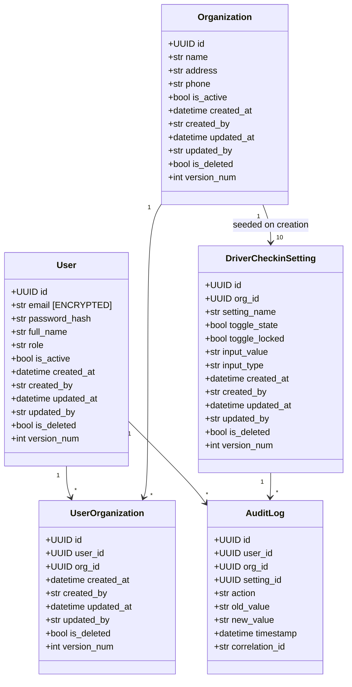

# Low-Level Design (LLD)
## Driver Check In Admin Module — The Hive (Schreiber Foods)
**Document Version:** 1.0.0
**Baseline Reference:** kb-L3-driver-checkin-baseline v0.1.0
**Epic Coverage:** EP-01 through EP-05 (Sprints 1–4)
**Stack:** Python 3.12 + FastAPI + SQLAlchemy 2.x + Oracle 19c

---

## 1. Domain Model



---

## 2. Database Schemas

> All tables follow the standard audit column set.
> **Standard audit columns (all tables):** `ID`, `CREATED_AT`, `CREATED_BY`, `UPDATED_AT`, `UPDATED_BY`, `IS_DELETED`, `VERSION_NUM`
> **Isolation:** All write operations use `SERIALIZABLE` isolation. Reads use `READ COMMITTED`.

---

### 2.1 HIVE_CORE Schema (Sprint 1) [EP-01]

#### HIVE_CORE.USERS

| Column | Oracle Type | Constraints | Notes |
|--------|------------|-------------|-------|
| ID | RAW(16) | PK | UUID stored as RAW |
| EMAIL | VARCHAR2(200) | UNIQUE · NOT NULL | [ENCRYPTED] Oracle TDE column-level |
| PASSWORD_HASH | VARCHAR2(500) | NOT NULL | bcrypt hash |
| FULL_NAME | VARCHAR2(200) | NOT NULL | |
| ROLE | VARCHAR2(20) | NOT NULL | CHECK IN ('ADMIN','STANDARD') |
| IS_ACTIVE | NUMBER(1) | NOT NULL DEFAULT 1 | |
| FAILED_LOGIN_COUNT | NUMBER(3) | NOT NULL DEFAULT 0 | Rate limiting (US-001) |
| LOCKED_UNTIL | TIMESTAMP WITH TIME ZONE | NULL | Null = not locked |
| CREATED_AT | TIMESTAMP WITH TIME ZONE | NOT NULL | |
| CREATED_BY | VARCHAR2(100) | NOT NULL | |
| UPDATED_AT | TIMESTAMP WITH TIME ZONE | NOT NULL | |
| UPDATED_BY | VARCHAR2(100) | NOT NULL | |
| IS_DELETED | NUMBER(1) | NOT NULL DEFAULT 0 | Soft delete |
| VERSION_NUM | NUMBER(10) | NOT NULL DEFAULT 1 | Optimistic lock |

**Indexes:**
```sql
CREATE UNIQUE INDEX UX_USERS_EMAIL ON HIVE_CORE.USERS (EMAIL) WHERE IS_DELETED = 0;
CREATE INDEX IX_USERS_ROLE ON HIVE_CORE.USERS (ROLE);
CREATE INDEX IX_USERS_IS_ACTIVE ON HIVE_CORE.USERS (IS_ACTIVE);
```

---

#### HIVE_CORE.ORGANIZATIONS

| Column | Oracle Type | Constraints | Notes |
|--------|------------|-------------|-------|
| ID | RAW(16) | PK | UUID |
| NAME | VARCHAR2(200) | NOT NULL | Org display name |
| ADDRESS | VARCHAR2(500) | NULL | |
| PHONE | VARCHAR2(30) | NULL | Used as {TRAFFIC_CLERK_PHONE} placeholder |
| IS_ACTIVE | NUMBER(1) | NOT NULL DEFAULT 1 | |
| CREATED_AT | TIMESTAMP WITH TIME ZONE | NOT NULL | |
| CREATED_BY | VARCHAR2(100) | NOT NULL | |
| UPDATED_AT | TIMESTAMP WITH TIME ZONE | NOT NULL | |
| UPDATED_BY | VARCHAR2(100) | NOT NULL | |
| IS_DELETED | NUMBER(1) | NOT NULL DEFAULT 0 | |
| VERSION_NUM | NUMBER(10) | NOT NULL DEFAULT 1 | |

**Indexes:**
```sql
CREATE UNIQUE INDEX UX_ORGANIZATIONS_NAME ON HIVE_CORE.ORGANIZATIONS (NAME) WHERE IS_DELETED = 0;
CREATE INDEX IX_ORGANIZATIONS_IS_ACTIVE ON HIVE_CORE.ORGANIZATIONS (IS_ACTIVE);
```

---

#### HIVE_CORE.USER_ORGANIZATIONS

| Column | Oracle Type | Constraints | Notes |
|--------|------------|-------------|-------|
| ID | RAW(16) | PK | UUID |
| USER_ID | RAW(16) | NOT NULL · FK → USERS.ID | |
| ORG_ID | RAW(16) | NOT NULL · FK → ORGANIZATIONS.ID | |
| CREATED_AT | TIMESTAMP WITH TIME ZONE | NOT NULL | |
| CREATED_BY | VARCHAR2(100) | NOT NULL | |
| UPDATED_AT | TIMESTAMP WITH TIME ZONE | NOT NULL | |
| UPDATED_BY | VARCHAR2(100) | NOT NULL | |
| IS_DELETED | NUMBER(1) | NOT NULL DEFAULT 0 | |
| VERSION_NUM | NUMBER(10) | NOT NULL DEFAULT 1 | |

**Indexes:**
```sql
CREATE UNIQUE INDEX UX_USER_ORG ON HIVE_CORE.USER_ORGANIZATIONS (USER_ID, ORG_ID) WHERE IS_DELETED = 0;
CREATE INDEX IX_USER_ORGANIZATIONS_USER_ID ON HIVE_CORE.USER_ORGANIZATIONS (USER_ID);
CREATE INDEX IX_USER_ORGANIZATIONS_ORG_ID ON HIVE_CORE.USER_ORGANIZATIONS (ORG_ID);
```

---

### 2.2 HIVE_CHECKIN Schema (Sprints 2–4) [EP-02–EP-05]

#### HIVE_CHECKIN.DRIVER_CHECKIN_SETTINGS

| Column | Oracle Type | Constraints | Notes |
|--------|------------|-------------|-------|
| ID | RAW(16) | PK | UUID |
| ORG_ID | RAW(16) | NOT NULL · FK → HIVE_CORE.ORGANIZATIONS.ID | Per-org isolation key |
| SETTING_NAME | VARCHAR2(100) | NOT NULL | Enum: see seed data below |
| TOGGLE_STATE | NUMBER(1) | NOT NULL DEFAULT 0 | 0=OFF, 1=ON |
| TOGGLE_LOCKED | NUMBER(1) | NOT NULL DEFAULT 0 | 1=admin cannot change |
| INPUT_VALUE | VARCHAR2(2000) | NULL | Serialized; null if no input |
| INPUT_TYPE | VARCHAR2(20) | NULL | 'TEXT', 'NUMERIC', 'ALPHANUMERIC', 'TEXTAREA', null |
| DISPLAY_ORDER | NUMBER(3) | NOT NULL | Render order (1–10) |
| CREATED_AT | TIMESTAMP WITH TIME ZONE | NOT NULL | |
| CREATED_BY | VARCHAR2(100) | NOT NULL | |
| UPDATED_AT | TIMESTAMP WITH TIME ZONE | NOT NULL | |
| UPDATED_BY | VARCHAR2(100) | NOT NULL | |
| IS_DELETED | NUMBER(1) | NOT NULL DEFAULT 0 | |
| VERSION_NUM | NUMBER(10) | NOT NULL DEFAULT 1 | Optimistic locking (US-035) |

**Indexes:**
```sql
CREATE UNIQUE INDEX UX_DCS_ORG_SETTING ON HIVE_CHECKIN.DRIVER_CHECKIN_SETTINGS (ORG_ID, SETTING_NAME) WHERE IS_DELETED = 0;
CREATE INDEX IX_DCS_ORG_ID ON HIVE_CHECKIN.DRIVER_CHECKIN_SETTINGS (ORG_ID);
CREATE INDEX IX_DCS_TOGGLE_STATE ON HIVE_CHECKIN.DRIVER_CHECKIN_SETTINGS (ORG_ID, TOGGLE_STATE);
```

**Seed Data per Organization (10 rows, seeded on org creation):**

| SETTING_NAME | TOGGLE_STATE | TOGGLE_LOCKED | INPUT_TYPE | DEFAULT INPUT_VALUE | DISPLAY_ORDER |
|---|---|---|---|---|---|
| `ORGANIZATION_NAME` | 1 | 1 | TEXT | `{org.name}` | 1 |
| `QR_CODE_ACCESS` | 1 | 0 | null | null | 2 |
| `DRIVER_NAME` | 1 | 1 | null | null | 3 |
| `DRIVER_ID` | 1 | 0 | null | null | 4 |
| `DRIVER_PHONE_NUMBER` | 1 | 1 | null | null | 5 |
| `TRUCK_NUMBER` | 1 | 1 | null | null | 6 |
| `CARRIER_APPROVAL_STEP` | 1 | 0 | null | null | 7 |
| `TEMPERATURE_ACKNOWLEDGEMENT` | 0 | 0 | ALPHANUMERIC | null | 8 |
| `EARLY_CHECK_IN_STEP` | 0 | 0 | COMPOSITE | null | 9 |
| `CONFIRMATION_STEP` | 1 | 0 | TEXTAREA | `Driver Check In is successfully completed! ...` | 10 |

> `EARLY_CHECK_IN_STEP` stores a JSON string: `{"hours": null, "instruction": "Due to earlier arrival time...{TRAFFIC_CLERK_PHONE}"}` when toggle is first enabled.

---

#### HIVE_CHECKIN.AUDIT_LOGS [EP-05 · F-05.3 · US-034]

| Column | Oracle Type | Constraints | Notes |
|--------|------------|-------------|-------|
| ID | RAW(16) | PK | UUID |
| USER_ID | RAW(16) | NOT NULL · FK → HIVE_CORE.USERS.ID | Who made the change |
| ORG_ID | RAW(16) | NOT NULL · FK → HIVE_CORE.ORGANIZATIONS.ID | Which org |
| SETTING_ID | RAW(16) | NULL · FK → DRIVER_CHECKIN_SETTINGS.ID | Which setting (null for org-level events) |
| ACTION | VARCHAR2(50) | NOT NULL | 'TOGGLE_CHANGE', 'VALUE_CHANGE', 'SETTING_CREATED' |
| OLD_VALUE | VARCHAR2(2000) | NULL | Serialized previous value |
| NEW_VALUE | VARCHAR2(2000) | NULL | Serialized new value |
| TIMESTAMP | TIMESTAMP WITH TIME ZONE | NOT NULL | Indexed; server-side UTC |
| CORRELATION_ID | VARCHAR2(100) | NULL | `X-Correlation-Id` from request |

> Audit log is **append-only** — no UPDATE or DELETE operations ever issued on this table.
> No `VERSION_NUM` or `IS_DELETED` — immutable by design.

**Indexes:**
```sql
CREATE INDEX IX_AUDIT_ORG_TIMESTAMP ON HIVE_CHECKIN.AUDIT_LOGS (ORG_ID, TIMESTAMP DESC);
CREATE INDEX IX_AUDIT_USER_ID ON HIVE_CHECKIN.AUDIT_LOGS (USER_ID);
CREATE INDEX IX_AUDIT_SETTING_ID ON HIVE_CHECKIN.AUDIT_LOGS (SETTING_ID);
```

---

## 3. Migration Plan

### Sprint 1 — Initial Schema Creation (Greenfield)

```sql
-- Migration: 001_create_hive_core_schema.sql
CREATE USER HIVE_CORE IDENTIFIED BY ... DEFAULT TABLESPACE users;
GRANT CREATE SESSION, CREATE TABLE, CREATE INDEX TO HIVE_CORE;

CREATE TABLE HIVE_CORE.USERS (...);  -- as defined above
CREATE TABLE HIVE_CORE.ORGANIZATIONS (...);
CREATE TABLE HIVE_CORE.USER_ORGANIZATIONS (...);
-- All indexes created in same migration
```

### Sprint 2 — HIVE_CHECKIN Schema

```sql
-- Migration: 002_create_hive_checkin_schema.sql
CREATE USER HIVE_CHECKIN IDENTIFIED BY ... DEFAULT TABLESPACE users;
GRANT SELECT ON HIVE_CORE.ORGANIZATIONS TO HIVE_CHECKIN;
GRANT SELECT ON HIVE_CORE.USERS TO HIVE_CHECKIN;

CREATE TABLE HIVE_CHECKIN.DRIVER_CHECKIN_SETTINGS (...);
-- Indexes created in same migration
-- Seed data INSERT via separate seed script triggered post-migration
```

### Sprint 4 — Audit Log Table

```sql
-- Migration: 003_add_audit_logs.sql  [Additive only — zero-downtime safe]
CREATE TABLE HIVE_CHECKIN.AUDIT_LOGS (...);
-- Indexes created in same migration
-- No changes to existing tables
```

### Zero-Downtime Strategy
- All Alembic migrations run as a pre-deploy Kubernetes Job
- Migrations are additive only (new tables, new nullable columns with defaults)
- Running pods remain functional during migration (no DDL blocking existing queries)
- Destructive changes (if ever needed) follow 2-sprint process:
  1. Sprint N: Add new column/table; backfill; dual-write in code
  2. Sprint N+1: Remove old column after all pods have migrated

---

## 4. CQRS Handlers (Python / FastAPI + SQLAlchemy)

> Pattern: FastAPI route → service function → repository → Oracle DB
> Validation: Pydantic v2 models on all request bodies (FastAPI built-in)
> All handlers include: auth middleware validation, X-Organization-Id check, correlation ID threading

---

### 4.1 Auth Handlers [EP-01 · F-01.1]

#### Handler: `login` (POST /api/v1/auth/login) [US-001]

```
INPUT:
  LoginRequest:
    email: str (required, valid email format)
    password: str (required, min 1 char)

VALIDATION (Pydantic v2):
  - email: EmailStr
  - password: str min_length=1

BUSINESS LOGIC:
  1. SELECT user FROM USERS WHERE email = :email AND is_deleted = 0
  2. IF user not found → return 401 (generic, no field hint)
  3. IF user.locked_until IS NOT NULL AND locked_until > NOW() → return 429 with retry_after
  4. bcrypt.verify(password, user.password_hash)
  5. IF verify fails:
       a. UPDATE USERS SET failed_login_count = failed_login_count + 1 WHERE id = user.id
       b. IF failed_login_count >= 5 within 15 min:
            UPDATE USERS SET locked_until = NOW() + 15min
       c. return 401 generic error
  6. IF verify passes:
       a. RESET USERS SET failed_login_count = 0, locked_until = NULL WHERE id = user.id
       b. jti = uuid4()
       c. access_payload = {sub: user.id, role: user.role, org_id: org_id, jti: jti, exp: now+30min}
       d. access_token = jwt.encode(access_payload, RS256_PRIVATE_KEY)  # 30min per EA5
       e. refresh_token = secrets.token_urlsafe(64)  # opaque, 7-day per EA5
       f. REDIS SET session:{jti} → {user_id, org_id} TTL=30min
       g. REDIS SET refresh:{refresh_token} → {user_id, org_id, jti} TTL=7d
       h. Set HttpOnly Secure SameSite=Strict cookie: refresh_token (7-day)
       i. Return access_token in response body (client stores in memory, NOT localStorage)
  7. return 200 {data: {access_token: "...", user: {id, full_name, role}}}

OUTPUT DTO:
  LoginResponse:
    data:
      access_token: str   # short-lived 30min; client holds in memory
      user:
        id: UUID
        full_name: str
        role: str

EVENTS: none (login events logged to structured log only)
ISOLATION: READ COMMITTED for SELECT; READ COMMITTED for UPDATE counter
```

---

#### Handler: `logout` (POST /api/v1/auth/logout) [US-002]

```
INPUT: Authorization: Bearer {access_token} header + HttpOnly refresh_token cookie

BUSINESS LOGIC:
  1. Extract jti from access JWT (already validated by middleware)
  2. Extract refresh_token from HttpOnly cookie
  3. REDIS SET blocklist:{jti} → "revoked" TTL=remaining_access_token_lifetime
  4. IF refresh_token present: REDIS DEL refresh:{refresh_token}
  5. Clear refresh_token HttpOnly cookie (Set-Cookie with empty value + past expiry)
  6. return 200

OUTPUT DTO: {data: {message: "Logged out successfully"}}
EVENTS: structured log entry
```

---

#### Handler: `refresh_token` (POST /api/v1/auth/refresh) [US-002]

```
INPUT: HttpOnly cookie containing refresh_token (opaque, 7-day per EA5)
       No request body needed

BUSINESS LOGIC:
  1. Extract refresh_token from HttpOnly cookie
  2. REDIS GET refresh:{refresh_token} → {user_id, org_id, old_jti}
  3. IF not found or expired → 401 (refresh token invalid/expired; user must re-login)
  4. IF valid:
       a. REDIS DEL refresh:{old_refresh_token}   ← rotate: invalidate old refresh token
       b. Add old_jti to access token blocklist: REDIS SET blocklist:{old_jti} TTL=30min
       c. Issue new access JWT (new jti, exp=now+30min)
       d. Issue new refresh token (opaque, exp=now+7d)
       e. Update Redis with new session and refresh entries
       f. Set new HttpOnly refresh_token cookie
  5. return 200 with new access token in body

OUTPUT DTO: {data: {access_token: str, user: {id, full_name, role}}}
```

---

### 4.2 Organization Handlers [EP-01 · F-01.3]

#### Handler: `list_organizations` (GET /api/v1/organizations) [US-005]

```
INPUT:
  QueryParams: page=1, page_size=20

AUTH: role=ADMIN required

BUSINESS LOGIC:
  SELECT o.*, (SELECT COUNT(*) FROM USER_ORGANIZATIONS uo
               WHERE uo.org_id = o.id AND uo.is_deleted = 0) AS user_count
  FROM HIVE_CORE.ORGANIZATIONS o
  WHERE o.is_deleted = 0
  ORDER BY o.name ASC
  OFFSET (page-1)*page_size ROWS FETCH NEXT page_size ROWS ONLY

OUTPUT DTO:
  PaginatedOrganizationsResponse:
    data: List[OrganizationSummary]
    meta: {total, page, page_size, correlation_id}

  OrganizationSummary:
    id: UUID
    name: str
    address: str | None
    phone: str | None
    is_active: bool
    user_count: int
```

---

#### Handler: `create_organization` (POST /api/v1/organizations) [US-005]

```
INPUT:
  Headers: Idempotency-Key: {UUID}  (required on all POST per EA3)
  CreateOrganizationRequest:
    name: str (required, max 200 chars)
    address: str | None (max 500 chars)
    phone: str | None (max 30 chars)

AUTH: role=ADMIN required

VALIDATION:
  - name: non-empty, max 200
  - address: max 500 if provided
  - phone: max 30 if provided
  - Uniqueness: name must not exist in active orgs → 409 if duplicate

BUSINESS LOGIC: [SERIALIZABLE isolation]
  1. Check unique name constraint
  2. INSERT INTO HIVE_CORE.ORGANIZATIONS (id=uuid4(), name, address, phone,
       is_active=1, created_by=current_user_id, ...)
  3. Seed 10 settings rows in HIVE_CHECKIN.DRIVER_CHECKIN_SETTINGS
     (one INSERT per setting with defaults — see seed data table)
     ORGANIZATION_NAME setting: input_value = org.name
  4. return 201 with created org

OUTPUT DTO: OrganizationDetail (full record)
EVENTS: structured log "org.created"
```

---

#### Handler: `update_organization` (PUT /api/v1/organizations/{id}) [US-005]

```
INPUT:
  UpdateOrganizationRequest:
    name: str | None
    address: str | None
    phone: str | None
    version_num: int (required for optimistic lock)

AUTH: role=ADMIN required

BUSINESS LOGIC: [SERIALIZABLE isolation]
  1. Fetch org by id WHERE is_deleted = 0
  2. IF version_num != org.version_num → 409 Conflict
  3. IF name changed: check uniqueness
  4. UPDATE org fields + version_num += 1
  5. IF name changed: also UPDATE DRIVER_CHECKIN_SETTINGS
     SET input_value = :new_name
     WHERE org_id = :id AND setting_name = 'ORGANIZATION_NAME'
  6. return 200 updated org

OUTPUT DTO: OrganizationDetail
```

---

#### Handler: `delete_organization` (DELETE /api/v1/organizations/{id}) [US-005]

```
INPUT: org id (path param)

AUTH: role=ADMIN required

BUSINESS LOGIC: [READ COMMITTED]
  1. Soft-delete: UPDATE HIVE_CORE.ORGANIZATIONS SET is_deleted = 1 WHERE id = :id
  2. Cascade soft-delete: UPDATE USER_ORGANIZATIONS SET is_deleted = 1 WHERE org_id = :id
  3. Soft-delete settings: UPDATE DRIVER_CHECKIN_SETTINGS SET is_deleted = 1 WHERE org_id = :id
  4. return 204

OUTPUT: 204 No Content
```

---

#### Handler: `assign_user_to_org` (POST /api/v1/organizations/{id}/users) [US-006]

```
INPUT:
  Headers: Idempotency-Key: {UUID}  (required on all POST per EA3)
  AssignUserRequest:
    user_id: UUID (required)

AUTH: role=ADMIN required

BUSINESS LOGIC: [SERIALIZABLE]
  1. Verify user exists and is_active
  2. Verify org exists and is_active
  3. Check no existing active assignment (UX_USER_ORG constraint guard)
  4. INSERT INTO USER_ORGANIZATIONS (id, user_id, org_id, ...)
  5. return 201

OUTPUT DTO: {data: {user_id, org_id, assigned_at}}
```

---

#### Handler: `remove_user_from_org` (DELETE /api/v1/organizations/{org_id}/users/{user_id}) [US-006]

```
INPUT: org_id, user_id (path params)

BUSINESS LOGIC:
  UPDATE USER_ORGANIZATIONS SET is_deleted = 1
  WHERE user_id = :user_id AND org_id = :org_id
  return 204
```

---

### 4.3 Settings Handlers [EP-02–EP-03 · F-02.1–F-03.3]

#### Handler: `get_settings` (GET /api/v1/driver-checkin/settings) [US-009, US-015]

```
INPUT:
  Headers: X-Organization-Id (validated vs JWT org_id claim)

AUTH: role=ADMIN required; org_id from JWT

BUSINESS LOGIC:
  1. Check Redis: GET settings:{org_id}
  2. IF cache miss:
       SELECT * FROM HIVE_CHECKIN.DRIVER_CHECKIN_SETTINGS
       WHERE org_id = :org_id AND is_deleted = 0
       ORDER BY display_order ASC
       [READ COMMITTED]
  3. IF empty result (new org without settings): return empty list with warning
  4. SET Redis settings:{org_id} TTL=30s
  5. Map to SettingResponse DTOs
  6. return 200 with data array

OUTPUT DTO:
  SettingsListResponse:
    data: List[SettingResponse]
    meta: {org_id, total, correlation_id}

  SettingResponse:
    id: UUID
    setting_name: str
    toggle_state: bool
    toggle_locked: bool
    input_value: str | None
    input_type: str | None
    display_order: int
    version_num: int
    updated_at: datetime
    updated_by: str
```

---

#### Handler: `update_setting` (PUT /api/v1/driver-checkin/settings/{id}) [US-010–013, US-016–018, US-020–025]

```
INPUT:
  Headers: Idempotency-Key: {UUID}  (required on all PUT per EA3; duplicate key = replay last response)
  UpdateSettingRequest:
    toggle_state: bool | None   (provide to change toggle)
    input_value: str | None     (provide to change input)
    version_num: int            (REQUIRED — optimistic lock, US-035)

AUTH: role=ADMIN required; org_id from JWT

VALIDATION (Pydantic v2 + custom validators):
  1. At least one of toggle_state or input_value must be provided
  2. IF toggle_state provided AND setting.toggle_locked == True:
       → 422 "This setting cannot be toggled"
  3. IF input_value provided:
       Retrieve setting's input_type:
       - ALPHANUMERIC: pattern ^[a-zA-Z0-9\s\-°/]+$, max 200 chars
       - NUMERIC (hours field): pattern ^\d+$, min 1, max 999
       - TEXTAREA / TEXT: max 2000 chars
       - COMPOSITE (EARLY_CHECK_IN_STEP): validate JSON structure
         {hours: int (^\d+$), instruction: str (non-empty, max 2000)}
  4. IF toggle_state = True AND setting has input:
       input_value must not be null/empty (except ORGANIZATION_NAME which is pre-populated)
  5. IF toggle_state = False AND setting has input:
       validation of input_value is SKIPPED (disabled field)

BUSINESS LOGIC: [SERIALIZABLE isolation]
  1. SELECT setting WHERE id = :id AND org_id = :jwt_org_id AND is_deleted = 0
     [Verify setting belongs to caller's org — prevents cross-org manipulation]
  2. IF setting not found → 404
  3. IF setting.version_num != request.version_num → 409 Conflict
     {error: "Settings modified by another user — reload to continue"}
  4. Capture old values for audit:
       old_toggle = setting.toggle_state
       old_value = setting.input_value
  5. Apply update:
       UPDATE DRIVER_CHECKIN_SETTINGS SET
         toggle_state = :new_toggle (if provided),
         input_value = :new_value (if provided),
         version_num = version_num + 1,
         updated_at = NOW(),
         updated_by = :user_id
       WHERE id = :id AND version_num = :expected_version
  6. IF rows_affected == 0 → 409 Conflict (concurrent write detected despite step 3)
  7. DEL Redis settings:{org_id}   ← cache invalidation
  8. DEL Redis mobile_settings:{org_id}   ← mobile cache invalidation
  9. Async audit log write (non-blocking, US-034):
       INSERT INTO AUDIT_LOGS (
         id=uuid4(), user_id=:user_id, org_id=:org_id,
         setting_id=:id,
         action='TOGGLE_CHANGE' if toggle changed else 'VALUE_CHANGE',
         old_value=str(old_val), new_value=str(new_val),
         timestamp=NOW(), correlation_id=:correlation_id
       )
       IF audit write fails → log structured warning, raise ops alert, DO NOT rollback save
  10. return 200 {data: {id, version_num: new_version, updated_at}}

OUTPUT DTO:
  UpdateSettingResponse:
    data:
      id: UUID
      version_num: int
      updated_at: datetime

EVENTS: structured log "setting.changed"
ERROR CODES:
  404 — setting not found or not in caller's org
  409 — version conflict (stale)
  422 — validation failure (with field-level errors)
```

---

### 4.4 QR Code Handlers [EP-04 · F-04.1–F-04.3]

#### Handler: `generate_qr_code` (POST /api/v1/driver-checkin/qr-code) [US-026, US-027]

```
INPUT: Headers: Idempotency-Key: {UUID}  (required on all POST per EA3)
       org_id from JWT

AUTH: role=ADMIN required

BUSINESS LOGIC:
  1. SELECT name FROM HIVE_CORE.ORGANIZATIONS WHERE id = :org_id
  2. Construct mobile check-in URL:
       url = f"https://hive.schreiber.com/checkin/{org_id}"
  3. qr = qrcode.QRCode(version=1, error_correction=ERROR_CORRECT_L, box_size=10, border=4)
     qr.add_data(url)
     qr.make(fit=True)
     img = qr.make_image(fill_color="black", back_color="white")
     buffer = BytesIO()
     img.save(buffer, format="PNG")
     buffer.seek(0)
  4. Log: structured log "qrcode.generated" {user_id, org_id, timestamp}
  5. return 200 with PNG bytes

OUTPUT: StreamingResponse(content=buffer, media_type="image/png")
  Headers: Content-Type: image/png
           Cache-Control: no-store (QR is org-specific and regenerated each time)
```

---

#### Handler: `download_qr_pdf` (GET /api/v1/driver-checkin/qr-code/pdf) [US-028]

```
INPUT: none (org_id from JWT)

AUTH: role=ADMIN required

BUSINESS LOGIC:
  1. Regenerate QR PNG (same logic as generate_qr_code)
  2. Fetch org_name from ORGANIZATIONS
  3. Build PDF:
       Using ReportLab (or WeasyPrint if HTML template preferred):
       - Page: A4
       - Header: org_name + "Driver Check In Access"
       - Body: QR image centered
       - Footer: URL text
  4. return PDF bytes

OUTPUT: StreamingResponse(content=pdf_bytes, media_type="application/pdf")
  Headers:
    Content-Type: application/pdf
    Content-Disposition: attachment; filename="QR-{org_name}-checkin.pdf"
    Cache-Control: no-store
```

---

### 4.5 Mobile API Handler [EP-05 · F-05.1]

#### Handler: `get_mobile_settings` (GET /api/v1/driver-checkin/settings/mobile) [US-029, US-030]

```
INPUT:
  Headers: Authorization: Bearer {mobile_jwt}
           (Note: mobile endpoint does NOT use HttpOnly cookie — mobile JWT in header)

AUTH: JWT aud="mobile" claim required
      org_id extracted from mobile JWT

BUSINESS LOGIC:
  1. Verify mobile JWT: signature, exp, aud="mobile"
  2. Extract org_id from JWT
  3. Check Redis: GET mobile_settings:{org_id}
  4. IF cache miss:
       SELECT setting_name, input_value
       FROM HIVE_CHECKIN.DRIVER_CHECKIN_SETTINGS
       WHERE org_id = :org_id
         AND toggle_state = 1
         AND is_deleted = 0
       ORDER BY display_order ASC
       [READ COMMITTED]
  5. SET Redis mobile_settings:{org_id} TTL=30s
  6. Strip admin-only fields (toggle_locked, version_num, display_order, updated_by)
  7. return 200 filtered projection

OUTPUT DTO:
  MobileSettingsResponse:
    data: List[MobileSettingItem]

  MobileSettingItem:
    setting_name: str
    input_value: str | None

RATE LIMITING: 200 req/min per user (read, per EA3) — enforced at Ingress
SLA: P95 < 500ms
```

---

### 4.6 Query Handlers (Read-Only)

#### Handler: `get_setting_by_id` (GET /api/v1/driver-checkin/settings/{id})

```
INPUT: setting id (path param)
AUTH: role=ADMIN, org_id from JWT

BUSINESS LOGIC:
  SELECT * FROM DRIVER_CHECKIN_SETTINGS
  WHERE id = :id AND org_id = :jwt_org_id AND is_deleted = 0
  [READ COMMITTED]
  IF not found or org mismatch → 404

OUTPUT DTO: SettingResponse (full, same as get_settings list item)
```

---

#### Handler: `get_audit_log` (GET /api/v1/driver-checkin/audit) [US-034]

```
INPUT:
  QueryParams:
    page=1, page_size=50
    setting_id: UUID | None (filter by setting)
    from_date: date | None
    to_date: date | None

AUTH: role=ADMIN, org_id from JWT

BUSINESS LOGIC:
  SELECT al.*
  FROM HIVE_CHECKIN.AUDIT_LOGS al
  WHERE al.org_id = :org_id
    AND (:setting_id IS NULL OR al.setting_id = :setting_id)
    AND (:from_date IS NULL OR al.timestamp >= :from_date)
    AND (:to_date IS NULL OR al.timestamp <= :to_date)
  ORDER BY al.timestamp DESC
  OFFSET (page-1)*page_size ROWS FETCH NEXT page_size ROWS ONLY

OUTPUT DTO:
  AuditLogResponse:
    data: List[AuditLogEntry]
    meta: {total, page, page_size}

  AuditLogEntry:
    id: UUID
    user_id: UUID
    setting_id: UUID | None
    action: str
    old_value: str | None
    new_value: str | None
    timestamp: datetime
    correlation_id: str | None
```

---

## 5. Validation Rules Reference

| Setting | Field | Validation Rule | Error Message | Story |
|---------|-------|----------------|---------------|-------|
| Any | toggle_state | toggle_locked must be False | 422 "This setting cannot be toggled" | US-010 |
| Temperature Acknowledgement | input_value | Pattern: `^[a-zA-Z0-9\s\-°/]+$` max 200 | "Invalid format" | US-021 |
| Temperature Acknowledgement | input_value | Non-empty when toggle ON | "A value is required" | US-021 |
| Early Check In | hours | Pattern: `^\d+$` (integers only) | "Numbers only" | US-023 |
| Early Check In | hours | Non-empty integer when toggle ON | "A value is required" | US-023 |
| Early Check In | instruction | Non-empty string when toggle ON | "A value is required" | US-023 |
| Confirmation Step | input_value | Non-empty when toggle ON | "A value is required" | US-025 |
| Organization Name | input_value | Read-only; no client validation | N/A | US-016 |
| All settings | version_num | Required in PUT request | 422 "version_num is required" | US-035 |
| All PUT requests | version_num | Must match DB current version | 409 Conflict | US-035 |

---

## 6. State Machine Transition Table

| From State | To State | Trigger | Validation Rules | Side Effects |
|-----------|---------|---------|-----------------|--------------|
| OFF | ON | Admin toggles non-locked setting | toggle_locked = False; role = ADMIN | PUT 200; version_num+1; cache invalidated; audit logged; input field enabled in UI |
| ON | OFF | Admin toggles non-locked setting | toggle_locked = False; role = ADMIN | PUT 200; version_num+1; cache invalidated; audit logged; input field disabled; mobile sees setting removed |
| ON | ON (locked) | — | toggle_locked = True; no transition | 422 if toggle attempted |
| InputEmpty | InputDirty | Admin types in field | toggle_state = ON | Client-side only; no API |
| InputDirty | Validating | Focus out (blur) | toggle_state = ON | Client-side validation runs (<200ms) |
| Validating | ValidationFailed | Invalid format / empty | Input fails validation rules | Inline error displayed; no API call |
| Validating | Saving | Validation passes | All validation rules pass | PUT API call initiated |
| ValidationFailed | Validating | Admin corrects input, re-blurs | — | Error cleared; re-validate |
| Saving | Saved | PUT 200 OK | version_num matches | ✓ indicator shown 1.5s; version_num updated |
| Saving | SaveFailed | PUT 4xx / 5xx / timeout | — | Error toast displayed; retry available |
| SaveFailed | Saving | Admin clicks Retry | — | PUT re-sent with same payload |
| Saved | InputDirty | Admin edits again | — | Cycle repeats |

---

## 7. API Error Response Reference

All error responses follow RFC 7807 ProblemDetails:

```python
# FastAPI exception handler — all errors use this envelope
class ProblemDetail(BaseModel):
    type: str           # e.g. "https://hive.schreiber.com/errors/validation-error"
    title: str          # human-readable
    status: int         # HTTP status code
    detail: str         # specific description
    instance: str       # request path
    errors: list | None # field-level errors for 422
    correlation_id: str
```

| HTTP Status | When | type URI fragment |
|------------|------|-------------------|
| 200 | Success | — |
| 201 | Resource created | — |
| 204 | Deleted (no body) | — |
| 400 | Malformed request | `bad-request` |
| 401 | Not authenticated / expired | `unauthorized` |
| 403 | Wrong role or org mismatch | `forbidden` |
| 404 | Resource not found | `not-found` |
| 409 | Optimistic lock conflict | `conflict` |
| 422 | Validation failure | `validation-error` |
| 429 | Rate limit / account lock | `rate-limited` |
| 503 | DB / dependency unavailable | `service-unavailable` |

---

## 8. Python Module Structure

```
hive-backend/
├── main.py                        # FastAPI app creation, startup/shutdown lifespan
├── pyproject.toml                 # Dependencies (Poetry); pinned versions per EA16
│
├── app/
│   ├── api/                       # Layer 3: FastAPI routers, middleware, DI (EA2)
│   │   ├── routers/
│   │   │   ├── auth.py            # POST /auth/login, /auth/logout, /auth/refresh
│   │   │   ├── organizations.py   # GET/POST /organizations, PUT/DELETE /{id}, user assignment
│   │   │   ├── settings.py        # GET/PUT /driver-checkin/settings[/{id}]
│   │   │   ├── qr.py             # POST /driver-checkin/qr-code, GET /qr-code/pdf
│   │   │   └── mobile.py         # GET /driver-checkin/settings/mobile
│   │   ├── dependencies.py        # get_db, get_current_user, require_admin, require_org
│   │   └── middleware.py          # Correlation ID, structlog context, error handlers
│   │
│   ├── domain/                    # Layer 1: Models, schemas, enums, repo interfaces (EA2)
│   │   ├── models/
│   │   │   ├── user.py            # User SQLAlchemy ORM model
│   │   │   ├── organization.py    # Organization + UserOrganization ORM models
│   │   │   ├── setting.py         # DriverCheckinSetting ORM model
│   │   │   └── audit_log.py       # AuditLog ORM model
│   │   ├── schemas/
│   │   │   ├── auth.py            # LoginRequest, LoginResponse, RefreshResponse
│   │   │   ├── organizations.py   # CreateOrganizationRequest, OrganizationDetail, etc.
│   │   │   ├── settings.py        # SettingResponse, UpdateSettingRequest, etc.
│   │   │   ├── mobile.py          # MobileSettingsResponse, MobileSettingItem
│   │   │   └── audit.py           # AuditLogEntry, AuditLogResponse
│   │   ├── enums.py               # SettingName, InputType, AuditAction, Role
│   │   └── repositories/          # Repository Protocol interfaces (EA2)
│   │       ├── user_repository.py
│   │       ├── org_repository.py
│   │       ├── setting_repository.py
│   │       └── audit_repository.py
│   │
│   ├── service/                   # Layer 2: Business logic, use cases (EA2)
│   │   ├── auth_service.py        # login(), logout(), refresh_token()
│   │   ├── org_service.py         # CRUD + user assignment + settings seed
│   │   ├── settings_service.py    # get_settings(), update_setting() + optimistic lock
│   │   ├── settings_validators.py # Per-setting validation rules (ALPHANUMERIC, NUMERIC, COMPOSITE)
│   │   ├── qr_service.py          # generate_qr_png(), build_pdf()
│   │   ├── mobile_service.py      # get_mobile_settings() filtered projection
│   │   └── audit_service.py       # async_write_audit() — non-blocking write
│   │
│   ├── infrastructure/            # Layer: DB sessions, repo implementations, cache, tasks (EA2)
│   │   ├── database.py            # Oracle AsyncEngine, session factory (oracledb thin mode)
│   │   ├── cache.py               # Redis client factory, get/set/del helpers with TTL
│   │   ├── repositories/          # Concrete SQLAlchemy implementations
│   │   │   ├── user_repository.py
│   │   │   ├── org_repository.py
│   │   │   ├── setting_repository.py
│   │   │   └── audit_repository.py
│   │   └── tasks.py               # Celery task definitions (async audit flush, cache warm-up)
│   │
│   └── core/
│       ├── config.py              # Pydantic BaseSettings — all env vars
│       ├── security.py            # bcrypt (cost=12), RS256 JWT encode/decode, refresh token gen
│       └── exceptions.py          # BusinessRuleError → 422, NotFoundError → 404, ConflictError → 409
│
├── migrations/                    # Alembic migrations (EA2 naming)
│   ├── env.py
│   └── versions/
│       ├── 001_create_hive_core_schema.py
│       ├── 002_create_hive_checkin_schema.py
│       └── 003_add_audit_logs.py
│
└── tests/
    ├── unit/                      # pytest; mocked repositories (EA14)
    │   ├── test_auth_service.py
    │   ├── test_settings_service.py
    │   ├── test_settings_validators.py
    │   └── test_qr_service.py
    ├── integration/               # pytest + httpx TestClient + Oracle test schema (EA14)
    │   ├── test_auth_endpoints.py
    │   ├── test_organizations_endpoints.py
    │   ├── test_settings_endpoints.py
    │   └── test_mobile_endpoints.py
    └── factories/                 # factory_boy test data factories (EA14)
        ├── user_factory.py
        ├── org_factory.py
        └── setting_factory.py
```

---

## 9. SQLAlchemy ORM Models

> Located in `app/domain/models/` per EA2 layered structure.
> All timestamps use `timezone.utc` — never naive datetimes (EA4).

```python
# app/domain/models/user.py
from datetime import datetime, timezone

class User(Base):
    __tablename__ = "USERS"
    __table_args__ = {"schema": "HIVE_CORE"}

    id = Column(RAW(16), primary_key=True, default=lambda: uuid.uuid4().bytes)
    email = Column(String(200), nullable=False, unique=True)  # TDE encrypted at Oracle layer
    password_hash = Column(String(500), nullable=False)
    full_name = Column(String(200), nullable=False)
    role = Column(String(20), nullable=False)
    is_active = Column(Boolean, nullable=False, default=True)
    failed_login_count = Column(Integer, nullable=False, default=0)
    locked_until = Column(DateTime(timezone=True), nullable=True)
    # Standard audit columns — TIMESTAMP WITH TIME ZONE per EA4
    created_at = Column(DateTime(timezone=True), nullable=False,
                        default=lambda: datetime.now(timezone.utc))
    created_by = Column(String(100), nullable=False)
    updated_at = Column(DateTime(timezone=True), nullable=False,
                        default=lambda: datetime.now(timezone.utc),
                        onupdate=lambda: datetime.now(timezone.utc))
    updated_by = Column(String(100), nullable=False)
    is_deleted = Column(Boolean, nullable=False, default=False)
    version_num = Column(Integer, nullable=False, default=1)

# app/domain/models/setting.py
class DriverCheckinSetting(Base):
    __tablename__ = "DRIVER_CHECKIN_SETTINGS"
    __table_args__ = {"schema": "HIVE_CHECKIN"}

    id = Column(RAW(16), primary_key=True, default=lambda: uuid.uuid4().bytes)
    org_id = Column(RAW(16), ForeignKey("HIVE_CORE.ORGANIZATIONS.ID"), nullable=False)
    setting_name = Column(String(100), nullable=False)
    toggle_state = Column(Boolean, nullable=False, default=False)
    toggle_locked = Column(Boolean, nullable=False, default=False)
    input_value = Column(String(2000), nullable=True)
    input_type = Column(String(20), nullable=True)
    display_order = Column(Integer, nullable=False)
    created_at = Column(DateTime(timezone=True), nullable=False,
                        default=lambda: datetime.now(timezone.utc))
    created_by = Column(String(100), nullable=False)
    updated_at = Column(DateTime(timezone=True), nullable=False,
                        default=lambda: datetime.now(timezone.utc),
                        onupdate=lambda: datetime.now(timezone.utc))
    updated_by = Column(String(100), nullable=False)
    is_deleted = Column(Boolean, nullable=False, default=False)
    version_num = Column(Integer, nullable=False, default=1)

# app/domain/models/audit_log.py
class AuditLog(Base):
    __tablename__ = "AUDIT_LOGS"
    __table_args__ = {"schema": "HIVE_CHECKIN"}

    id = Column(RAW(16), primary_key=True, default=lambda: uuid.uuid4().bytes)
    user_id = Column(RAW(16), ForeignKey("HIVE_CORE.USERS.ID"), nullable=False)
    org_id = Column(RAW(16), ForeignKey("HIVE_CORE.ORGANIZATIONS.ID"), nullable=False)
    setting_id = Column(RAW(16), ForeignKey("HIVE_CHECKIN.DRIVER_CHECKIN_SETTINGS.ID"), nullable=True)
    action = Column(String(50), nullable=False)
    old_value = Column(String(2000), nullable=True)
    new_value = Column(String(2000), nullable=True)
    timestamp = Column(DateTime(timezone=True), nullable=False,
                       default=lambda: datetime.now(timezone.utc))
    correlation_id = Column(String(100), nullable=True)
    # No audit columns on AuditLog itself — append-only immutable table
```

---

## 10a. Frontend Module Structure

```
hive-frontend/
├── src/
│   ├── app/                        # App shell, providers, router (EA2/EA10)
│   │   ├── App.tsx                 # Root: QueryClientProvider + ZustandProvider + RouterProvider
│   │   ├── router.tsx              # React Router 6 route definitions; lazy-loaded pages
│   │   └── providers.tsx           # TanStack Query client config (staleTime, retry policy)
│   │
│   ├── features/                   # Feature modules — one per domain (EA2)
│   │   ├── auth/
│   │   │   ├── LoginPage.tsx       # Screen: /login
│   │   │   ├── useLogin.ts         # TanStack Query mutation: POST /auth/login
│   │   │   └── authStore.ts        # Zustand: access token in memory (NOT localStorage)
│   │   ├── organizations/
│   │   │   ├── OrganizationsPage.tsx   # Screen: /admin/organizations
│   │   │   ├── OrgFormModal.tsx        # Create / Edit modal (React Hook Form + Zod)
│   │   │   ├── useOrganizations.ts     # TanStack Query: GET /organizations
│   │   │   └── useOrgMutations.ts      # TanStack Query mutations: POST / PUT / DELETE
│   │   ├── settings/
│   │   │   ├── SettingsPage.tsx        # Screen: /admin/driver-checkin
│   │   │   ├── SettingRow.tsx          # Toggle + optional input per setting
│   │   │   ├── useSettings.ts          # TanStack Query: GET /driver-checkin/settings
│   │   │   ├── useUpdateSetting.ts     # Optimistic mutation: PUT /driver-checkin/settings/{id}
│   │   │   └── settingValidators.ts    # Zod schemas per input_type (ALPHANUMERIC, NUMERIC, etc.)
│   │   └── qr/
│   │       ├── QrModal.tsx             # Modal: QR image + Save PDF + Print + Close
│   │       └── useQrCode.ts            # TanStack Query mutation: POST /driver-checkin/qr-code
│   │
│   ├── shared/
│   │   ├── components/             # Atomic design (EA10): Button, Toggle, Input, Toast, Modal
│   │   ├── hooks/
│   │   │   ├── useAxiosInterceptors.ts # 401 → redirect; 5xx → toast (EA2 error handling)
│   │   │   └── useCorrelationId.ts     # Auto-generate + attach X-Correlation-Id
│   │   ├── api/
│   │   │   └── axiosClient.ts      # Axios 1.x instance; base URL; auth header injection
│   │   ├── utils/
│   │   │   └── dates.ts            # date-fns formatInTimeZone for display (EA4)
│   │   └── types/                  # Shared TypeScript types (strict mode, no `any`)
│   │
│   └── assets/
│
├── tests/                          # Jest 29 + RTL 14 + Playwright (EA14)
├── vite.config.ts                  # Vite 5.x build config
├── tsconfig.json                   # strict: true (EA13)
└── package.json                    # Exact versions, no ^ or ~ (EA16)
```

**Frontend State Management per EA2:**
- Server state (all API data): TanStack Query — `useSettings`, `useOrganizations`, etc.
- Client/UI state (sidebar, active tab, toast queue): Zustand store
- Form state: React Hook Form + Zod schemas for all forms (OrgFormModal, setting inputs)
- Access token: held in Zustand memory store only — **never `localStorage`** (EA5)

---

## 10b. Code Standards Reference

### Python (EA13)
- Formatter: `Black` (line length 120)
- Linter: `ruff` (replaces flake8 + isort)
- Type hints required on all function signatures
- Docstrings on all public functions (Google style)
- No `print()` — use `structlog` logger exclusively
- Max function length: 50 lines · Max file length: 300 lines
- No `*` imports
- bcrypt cost factor: 12 (EA5)

### TypeScript (EA13)
- `strict: true` in `tsconfig.json`
- No `any` type — use `unknown` + type guards
- Named exports only (no default exports)
- ESLint + Prettier enforced in CI
- ESLint Security plugin for JS/TS SAST (EA1)
- Max component length: 150 lines; extract custom hooks for logic > 10 lines

### SQL / PL/SQL (EA13)
- UPPERCASE for SQL keywords; snake_case for table/column names
- All DDL via Alembic migrations — never manual
- Bind variables always (never string concatenation)
- PL/SQL for any bulk or performance-critical operations (EA4)

### Test Naming (EA14)
- Python: `test_{what}_{when}_{expected}`
  e.g. `test_update_setting_when_version_stale_returns_409`
- TypeScript: `it('should {expected} when {condition}')`
  e.g. `it('should show validation error when hours field is non-numeric')`

## 11. Test Coverage Requirements

| Module | Type | Min Coverage | Key Scenarios |
|--------|------|-------------|---------------|
| `service/auth_service.py` | Unit | ≥ 80% | Valid login, invalid creds, brute force lockout, expired access JWT, refresh rotation, logout blocklist |
| `service/settings_service.py` | Unit | ≥ 80% | Get settings (cache hit/miss), update toggle, update value, optimistic lock conflict, locked toggle rejection |
| `service/settings_validators.py` | Unit | ≥ 80% | Alphanumeric pattern, numeric-only, empty required, composite JSON structure |
| `service/qr_service.py` | Unit | ≥ 80% | QR generation success, PDF generation success, org not found |
| `service/mobile_service.py` | Unit | ≥ 80% | Filtered projection (only ON settings), cache hit/miss, mobile JWT audience validation |
| `infrastructure/repositories/audit_repository.py` | Unit | ≥ 80% | Write success, write failure (does not block save), structured log format |
| All `api/routers/` | Integration | All endpoints | Full request/response cycle via httpx TestClient; auth middleware; org isolation; Idempotency-Key deduplication |
| Settings E2E | Integration | Critical path | Toggle → save → reload → verify persisted; conflict detection (409 on stale version) |
| Frontend components | Jest/Vitest + RTL | ≥ 80% | SettingRow toggle, validation error display, auto-save indicator, QrModal open/close |
| Frontend hooks | Jest/Vitest | ≥ 80% | `useUpdateSetting` optimistic update + rollback on 409/5xx |
| E2E journeys | Playwright | Critical paths | Login → settings → toggle → save; QR generate → PDF download; 403 page |
| Accessibility | axe-core + Playwright | Zero critical violations | WCAG 2.1 AA on all pages (Sprint 4) |

> **Backend test framework (EA14):** `pytest 8.x` + `pytest-asyncio` + `httpx` TestClient + `factory_boy 3.x`
> **Frontend test framework (EA14):** Jest 29.x / Vitest 1.x + React Testing Library 14.x + Playwright
> Unit tests: repository layer mocked via `unittest.mock` — no Oracle required
> Integration tests: Oracle XE test schema seeded per test run (CI via Oracle XE in Docker, EA6)
> Security scans (EA14): Bandit + ESLint Security + Trivy + Snyk — zero critical/high gate
